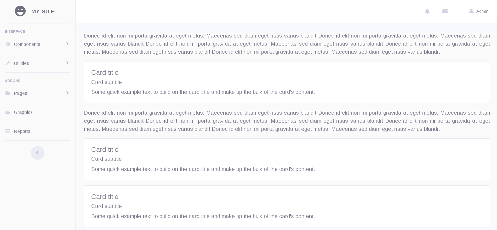

<h1>A Bootstrap 4 dashboard template</h1>

Demo: <a href="https://argenisosorio.github.io/bootstrap_4_dashboard_template/">Bootstrap 4 dashboard template</a>

Based on: <a href="https://startbootstrap.com/template-overviews/sb-admin-2/">Start Bootstrap - SB Admin 2</a>

<h2>Capture</h2>
